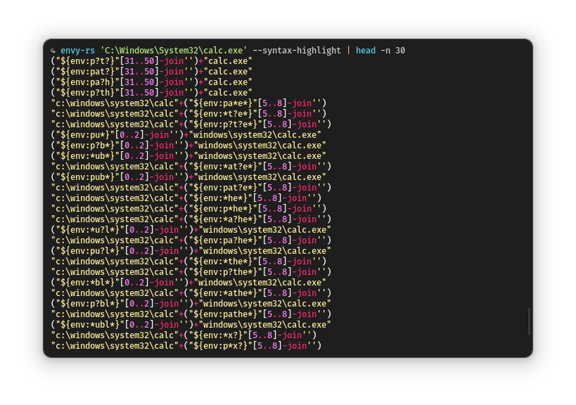

# envy-rs

 

Generate obfuscated Windows PowerShell payloads that resolve to paths by globbing environment variables.

# Wiki

Documentation has moved to the [wiki](https://github.com/lavafroth/envy-rs/wiki/Envy). Check it out!
